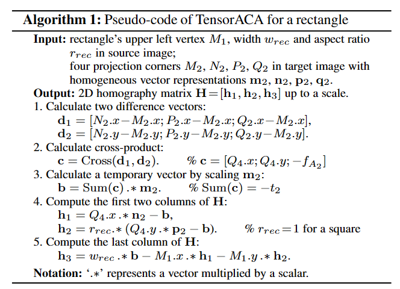
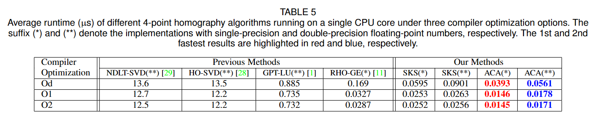

# SKS & ACA Decomposition of 2D Homography
This repository is the official implementation of the paper: 

**Fast and Interpretable 2D Homography Decomposition: Similarity-Kernel-Similarity (SKS) and Affine-Core-Affine (ACA)**. 

SKS and ACA are novel decomposition forms for 2D homography (projective transformation) matrices, which are superior to previous 4-point homography methods (NDLT-SVD, HO-SVD, GPT-LU, RHO-GE) in terms of computational efficiency, geometrical meaning of parameters, and unified management for various planar configurations. The uploaded codes include the Matlab, C++ (with OpenCV or CUDA library) and Python (with PyTorch library) procedures used in CPU and GPU experiments.
[Project Page] [Paper] [Video]

## SKS Decomposition
SKS decomposes a 2D homography into three sub-transformations: 
```math
\mathbf{H}=\mathbf{H}_{S_2}^{-1}*\mathbf{H}_{K}*\mathbf{H}_{S_1},
```
where $\mathbf{H}\_{S\_1}$ and $\mathbf{H}\_{S\_2}$ are similarity transformations induced by two arbitrary pairs of corresponding points on source plane and target plane, respectively; $\mathbf{H}\_{K}$ is the 4-DOF kernel transfromation we defined, which generates projective distortion between two similarity-normalized planes. 

## ACA Decomposition
ACA also decomposes a 2D homography into three sub-transformations: 
```math
\mathbf{H}=\mathbf{H}_{A_2}^{-1}*\mathbf{H}_{C}*\mathbf{H}_{A_1},
```
where $\mathbf{H}\_{A\_1}$ and $\mathbf{H}\_{A\_2}$ are affine transformations induced by three arbitrary pairs of corresponding points on source plane and target plane, respectively; $\mathbf{H}\_{C}$ is the 2-DOF core transfromation we defined, which generates projective distortion between two affinity-normalized planes.

## Geometric Meanings
In SKS and ACA, each sub-transformation, and even each parameter of these transformations has geometric meaning. The whole decomposition process is shown in the following figures.

 <div align="center">  </div> 
 
 <div align="center">  </div>

The first figure actually introduces one kind of further decomposition of the kernel transformation, i.e., 
```math
\mathbf{H}_{K}=\mathbf{H}_{E}^{-1}\mathbf{H}^{-1}_{T_2}\mathbf{H}_{G}\mathbf{H}_{T_1}\mathbf{H}_{E}.
```

## Algebraic Simplicity
SKS and ACA exhibit many unique properties in algebra, some of which are shown below.

### No Need to Construct A Linear System of Equations
Previous 4-point homography methods follow the same way to construct a square system of linear equations, followed by solving it through well-established matrix factorization methods, such as SVD and LU,
```math
\mathbf{A}_{8*9}*\mathbf{h}_{9*1}=\mathbf{0} \quad \mathcal{or} \quad \mathbf{A}_{8*8}*\mathbf{h}_{8*1}=\mathbf{b}_{8*1}.
```
Such approachs are circuitous since the constructed coefficient matrix $\mathbf{A}$ is redundant (including a number of 0 and 1). Conversely, SKS and ACA directly compute the sub-transformations of homography in a stratified way. 

### Division-Free Solver 
ACA is extremely concise in algebra and only requires 85 addtions, subtractions and multiplications of floating-point numbers to compute homographies up to a scale. Among four arithmetic operations, the most complicated division is avoided in ACA. 

### Floating-point Operations (FLOPs)
FLOPs of SKS and ACA for computing 4-point homographies up to a scale are 157 and 85 respectively. With the normalization based on the last element of homography, FLOPs of SKS and ACA are 169 and 97 respectively. Compared with commonly used robust 4-point homography solvers NDLT-SVD ($\ge$27K FLOPs) and GPT-LU (~1950 FLOPs), SKS and ACA represent {162x, 12x} and {282x, 20x}, respectively.

### Polynomial Expression of Each Element of Homography
Polynomial expression of each element of homography is easily obtained in our derivation, which is given by 
```math
\mathbf{H} = \begin{bmatrix} \mathcal{F}_{11}^8 & \mathcal{F}_{12}^8 & \mathcal{F}_{13}^9 \\
\mathcal{F}_{21}^8 & \mathcal{F}_{22}^8 & \mathcal{F}_{23}^9  \\ \mathcal{F}_{31}^7 & \mathcal{F}_{32}^7 & \mathcal{F}_{33}^8 \end{bmatrix},
```
where $\mathcal{F}^i$ denotes an $i$-th degree polynomial.

### Homographies Mapping A Rectangle to A Quadrangle
All previous 4-point offsets based deep homography methods compute the homography mapping a square (UDHN_RAL18, DHDS_CVPR20, LocalTrans_ICCV21, DAMG_TCSVT22, IDHN_CVPR22) or rectangle (UDIS_TIP21,CAUDHN_ECCV20) in source image to a general quadrangle in target image. However, the previous method treat the special rectanlge as a general quadrangle and no simplification is conducted. In SKS and ACA, homographies mapping a rectangle (or square) to a quadrangle are simplified straightforwardly. The complete steps of the tensorized ACA for a rectangle are illustrated in the following Algorithm with only 15 vector operations (47 FLOPs). Consequently, FLOPs for a source square will be reduced to 44 FLOPs.

<div align="center">  </div>

## Experiments
### CPU Runtime
Compared to the three robust methods (NDLT-SVD, HO-SVD and GPT-LU), SKS(\*\*) and ACA(\*\*) represents {488x, 477x, 29x} and {731x, 713x, 43x} respectively under 'O2' compiler optimization. These numbers are bigger than FLOPs ratios as their implementations in OpenCV include more or less
conditional branch judgments, data copy or exchange, OpenCV data structures, etc., which severely influence the speed. 

<div align="center">  </div>

### GPU Runtime
Runtime of multiple homographies computation in parallel on GPU is meaningful for both the feature-based RANSAC pipelines and the deep homography pipelines. Specifically, each 4-point homography is assigned to one thread of GPU for computation and the program statements will be sequentially executed by a GPU CUDA core. The total runtime of all algorithms for small numbers  ($\leq$10K) of homographies in Table increases slightly with the increase of the numbers. This is because the parallel computation of small numbers of homographies don't trigger all 10496 CUDA cores of NVIDIA 3090 GPU.

<div align="center">  </div>

From the tables, the fastest ACA algorithm can run about **70M** times on CPU and **4G** times on GPU.


